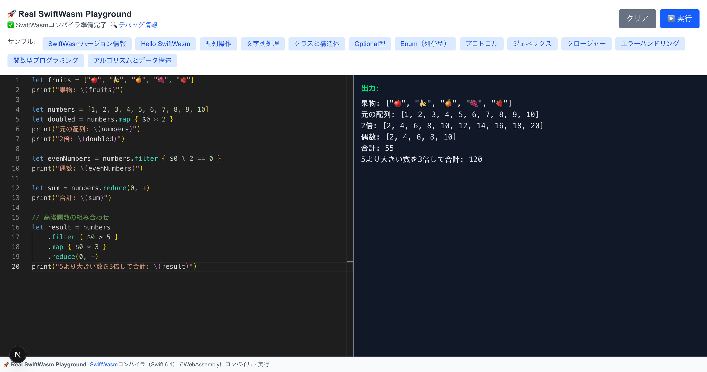

# 🚀 SwiftWasm Playground



ブラウザでSwiftコードをリアルタイムでWebAssemblyにコンパイル・実行できるオンラインプレイグラウンドです。SwiftWasm SDK 6.1を使用して、Swift 6.1のコードをWebAssemblyに変換し、ブラウザ内のカスタムWASI実装で実行します。

## ✨ 特徴

- **🔥 リアルタイムコンパイル**: SwiftWasm SDK 6.1でSwiftコードを即座にWebAssemblyに変換
- **🌐 ブラウザ内実行**: カスタムWASI実装によりWebAssemblyモジュールをブラウザで直接実行
- **💻 高機能エディタ**: Monaco EditorによるVS Code品質のSwiftコード編集体験
- **📚 豊富なサンプル**: Swift標準ライブラリの様々な機能を学べる実用的なサンプルコード
- **🔍 デバッグ機能**: SwiftWasmコンパイラの詳細情報とデバッグ情報を表示
- **🐳 Docker対応**: マルチアーキテクチャ（ARM64/x86_64）対応の安全な実行環境
- **⚡ Next.js 15**: 最新のNext.js App RouterとReact 19を活用

## 🏗️ アーキテクチャ

```
┌─────────────────┐    HTTP API    ┌─────────────────┐
│   Next.js       │ ─────────────► │   Next.js       │
│   Frontend      │                │   API Routes    │
│                 │ ◄───────────── │                 │
│ - Monaco Editor │   WASM Binary  │ - /api/compile  │
│ - WASI Impl     │   & Metadata   │ - /api/debug    │
│ - TypeScript    │                │ - /api/wasm/[id]│
└─────────────────┘                └─────────────────┘
                                         ▲     │
                                         │     │ Swift Code
                                         │     ▼
                                   ┌─────────────────┐
                                   │   Docker        │
                                   │   Environment   │
                                   │                 │
                                   │ - SwiftWasm SDK │
                                   │ - Swift 6.1     │
                                   │ - WASM Compiler │
                                   └─────────────────┘
```

### フロントエンド
- **Monaco Editor**: VS Codeと同じエディタエンジンによるSwiftコード編集
- **カスタムWASI実装**: WebAssembly System Interfaceの独自実装
- **TypeScript**: 型安全性を確保したReactコンポーネント
- **Tailwind CSS**: モダンでレスポンシブなUI
- **動的インポート**: SSRを無効化してクライアントサイドでのみ実行

### バックエンド（Next.js API Routes）
- **`/api/compile`**: Swiftコードのコンパイル処理
- **`/api/debug`**: SwiftWasmコンパイラのデバッグ情報取得
- **`/api/wasm/[id]`**: コンパイル済みWASMバイナリの配信
- **一時ファイル管理**: セキュアな一時ディレクトリでのファイル処理

## 📋 前提条件

- **Docker** & **Docker Compose**

## 🚀 セットアップ

```bash
# リポジトリをクローン
git clone git@github.com:OHMORIYUSUKE/swiftwasm-playground.git
cd swiftwasm-playground

# Dockerコンテナをビルドして起動
docker-compose up --build

# バックグラウンドで実行したい場合
docker-compose up -d --build
```

### Apple Silicon (M1/M2/M3) Mac向け設定

**方法1: 環境変数設定（推奨）**
```bash
# M1/M2/M3 Mac用（ARM64）
export DOCKER_DEFAULT_PLATFORM=linux/arm64
docker-compose up --build

# Intel Mac/PC用（x86_64）
export DOCKER_DEFAULT_PLATFORM=linux/amd64
docker-compose up --build
```

**方法2: .envファイル作成**
```bash
# プロジェクトルートに.envファイルを作成
echo "DOCKER_DEFAULT_PLATFORM=linux/arm64" > .env
docker-compose up --build
```

### ブラウザでアクセス
```
http://localhost:3000
```

## 📚 使用方法

### 基本的な使い方
1. **コード編集**: 左側のMonacoエディターでSwiftコードを編集
2. **サンプル選択**: ヘッダーのサンプルボタンで様々な例を試す
3. **コンパイル実行**: 「▶️ 実行」ボタンでコンパイルと実行
4. **結果確認**: 右側の出力パネルで結果を確認
5. **デバッグ情報**: 「🔍 デバッグ情報」ボタンでコンパイラ詳細を確認

## 🔧 技術詳細

### コンパイルプロセス
1. **リクエスト**: フロントエンドからSwiftコードを`/api/compile`に送信
2. **プロジェクト作成**: サーバーサイドで一時ディレクトリにSwiftパッケージプロジェクトを作成
3. **コンパイル**: SwiftWasm SDK 6.1を使用してWebAssemblyにコンパイル
4. **バイナリ保存**: 生成されたWASMバイナリを一時ファイルとして保存
5. **レスポンス**: WASMバイナリのIDをフロントエンドに返却
6. **実行**: フロントエンドが`/api/wasm/[id]`からWASMバイナリを取得してカスタムWASI環境で実行

### カスタムWASI実装
ブラウザでWebAssemblyを実行するために実装されたWASIシステムコール：

- **`fd_write`**: 標準出力/エラー出力の処理（コンソールへの出力）
- **`proc_exit`**: プロセス終了の処理
- **`environ_*`**: 環境変数の処理
- **`args_*`**: コマンドライン引数の処理
- **`clock_time_get`**: 時刻取得
- **`random_get`**: 暗号学的安全な乱数生成
- **`fd_fdstat_get`**: ファイルディスクリプタ統計情報

### API エンドポイント

#### POST `/api/compile`
Swiftコードをコンパイルします。
```typescript
// リクエスト
{
  "code": "print(\"Hello, SwiftWasm!\")"
}

// レスポンス（成功時）
{
  "success": true,
  "wasmId": "abc123def456",
  "message": "コンパイル成功"
}

// レスポンス（エラー時）
{
  "success": false,
  "error": "コンパイルエラーの詳細"
}
```

#### GET `/api/debug`
SwiftWasmコンパイラのデバッグ情報を取得します。
```typescript
// レスポンス
{
  "timestamp": "2024-01-01T00:00:00.000Z",
  "checks": {
    "swiftVersion": {
      "status": "success",
      "output": "swift-driver version: 1.87.3 Swift version: 6.1"
    },
    "swiftSdks": {
      "status": "success", 
      "hasWasmSdk": true,
      "output": "WASI SDK が利用可能です"
    },
    "environment": {
      "platform": "linux",
      "arch": "arm64"
    }
  }
}
```

#### GET `/api/wasm/[id]`
コンパイル済みのWASMバイナリを取得します。
```
Content-Type: application/wasm
```

### 技術スタック
- **フロントエンド**: Next.js 15, React 19, TypeScript, Monaco Editor, Tailwind CSS
- **バックエンド**: Next.js API Routes, Node.js
- **コンパイラ**: SwiftWasm SDK 6.1, Swift 6.1
- **実行環境**: WebAssembly, カスタムWASI実装
- **インフラ**: Docker, Docker Compose（マルチアーキテクチャ対応）
- **開発ツール**: TypeScript, ESLint, PostCSS

## 🚨 トラブルシューティング

### Docker関連の問題

#### Apple Silicon (M1/M2/M3) でのアーキテクチャエラー
```bash
# エラー例: Dynamic loader not found: /lib64/ld-linux-x86-64.so.2
# 解決策: ARM64プラットフォームを指定
export DOCKER_DEFAULT_PLATFORM=linux/arm64
docker-compose up --build

# または x86_64で実行（Rosetta 2使用、遅くなる場合があります）
export DOCKER_DEFAULT_PLATFORM=linux/amd64
docker-compose up --build
```

#### Dockerビルドが失敗する
```bash
# キャッシュをクリアして再構築
docker-compose build --no-cache

# 古いイメージ・コンテナを削除
docker system prune -a
docker-compose down --volumes --remove-orphans
```

#### メモリ不足エラー
```bash
# Docker Desktopの設定でリソース制限を増加
# Settings > Resources > Advanced で Memory を 4GB 以上に設定
```

### アプリケーションの問題

#### コンパイラAPIに接続できない
1. Next.jsアプリケーションが起動していることを確認
2. ポート3000が使用可能であることを確認
3. `docker-compose logs app` でログを確認
4. ブラウザの開発者ツールでネットワークエラーをチェック

#### ハイドレーションエラー
```
Error: A tree hydrated but some attributes...
```
このエラーはブラウザ拡張機能が原因の場合があります。プライベートブラウジングモードで試してください。

#### WASMファイルが見つからない
コンパイル後にWASMファイルが見つからない場合：
1. `/tmp` ディレクトリの容量を確認
2. Dockerコンテナの再起動を試す
3. 一時ファイルが正しく作成されているかログで確認

## 🛠️ 開発者向け情報

### プロジェクト構造
```
swiftwasm-playground/
├── src/
│   ├── app/
│   │   ├── api/
│   │   │   ├── compile/       # コンパイルAPI
│   │   │   ├── debug/         # デバッグ情報API
│   │   │   └── wasm/[id]/     # WASMバイナリ配信API
│   │   ├── layout.tsx         # アプリケーションレイアウト
│   │   └── page.tsx           # メインページ
│   ├── components/
│   │   └── SwiftPlayground.tsx # メインコンポーネント
│   ├── data/
│   │   └── examples.ts        # サンプルコード定義
│   ├── types/
│   │   └── index.ts           # TypeScript型定義
│   └── utils/
│       ├── compiler.ts        # コンパイラAPI関数
│       └── wasi.ts            # WASI実装
├── docker-compose.yml         # Docker構成
├── Dockerfile                 # Docker設定
└── package.json               # プロジェクト設定
```

## 📖 参考資料

- [SwiftWasm公式サイト](https://swiftwasm.org/)
- [SwiftWasm Book](https://book.swiftwasm.org/)
- [SwiftWasm GitHub](https://github.com/swiftwasm/swift)
- [WebAssembly](https://webassembly.org/)
- [WASI](https://wasi.dev/)
- [Next.js App Router](https://nextjs.org/docs/app)
- [Monaco Editor](https://microsoft.github.io/monaco-editor/)

